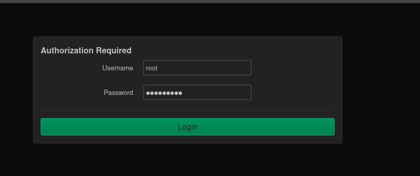
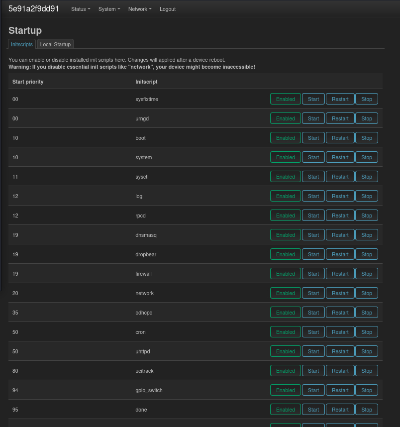
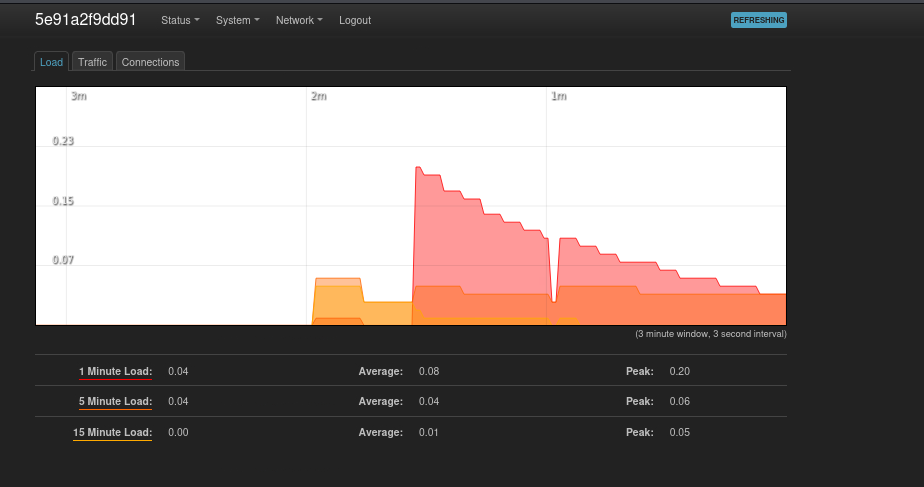
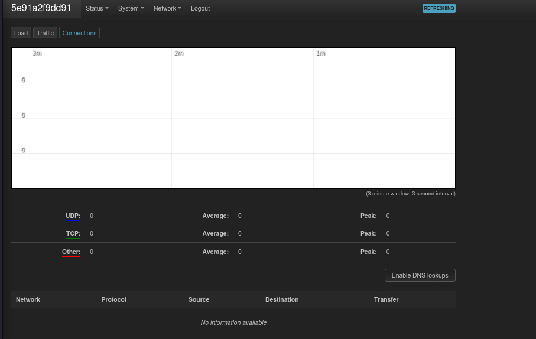

Date: 2026-02-12

status: Completed
platform: TryHackMe
difficulty: Intermediate

VPN Hardening


Openwrt


System


Router Status host name / time zone


Router Password / Password was changed


SSH Access / port 22 configuration


Startup/ init priority scripts


Network Traffic Rules
Showing Allow-Ping, Allow-DHCP


Status Real Time Graph Traffic
Network Monitoring


Connections are zero at the moment


Loads


Network Firewall Port Forward


System Software
Shows available packages- too many to screenshot


# All Lab Questions

## Task 1: Introduction

- Answer the questions below (informational task)

## Task 2: Common Threat and Attack Vectors

1. **The device that is used to control and manage network resource is called?**
    - Answer: `Network device`
2. **A threat vector that includes disruption of critical devices and services to make them unavailable to genuine users is called?**
    - Answer: `Denial of Service`

## Task 3: General Techniques

- (No questions visible in screenshots - likely informational)

## Task 4: Hardening Virtual Private Networks

1. **Update the config file to use cipher AES-128-CBC. What is the flag value linked with the cipher directive?**
    - Answer: `THM{CIPHER_UPDATED_1101}`
2. **Update the config file to use auth SHA512. What is the flag value linked with the auth directive?**
    - Answer: `THM{AUTH_UPDATED_123}`
3. **As per the config file, what is the port number for the OpenVPN server?**
    - Answer: `1194`

## Task 5: Hardening Routers, Switches, and Firewalls

1. **Update the password of the router to TryHackMe123.**
    - Answer: `No answer needed`
2. **What is the default SSH port configured for OpenWrt in the attached VM?**
    - Answer: `22`
3. **Go through the General Settings option under the System tab in the attached VM. The administrator has left a special message in the Notes section. What is the flag value?**
    - Answer: `THM{SYSTEM101}`
4. **What is the default system log buffer size value for the OpenWrt router in the attached VM?**
    - Answer: `64`
5. **What is the start priority for the script uhttpd?**
    - Answer: `50`

## Task 6: Additional Hardening Techniques in an Enterprise Environment

1. **What is the name of the rule that accepts ICMP traffic from source zone WAN and destination zone as this device?**
    - Answer: `Allow-Ping`
2. **What is the name of the rule that forwards data coming from WAN port 9001 to LAN port 9002?**
    - Answer: `THM_PORT`
3. **What is the version number for the available apk package?**
    - Answer: `2.12.2-1`

## Task 7: Important Tools for Network Monitoring

- (Informational task - no questions)

---

# What I Learned: Network Device Hardening

## Key Learning Areas

### 1. Threat Landscape & Attack Surface Analysis

**Understanding Network vs Endpoint Devices:** Network devices (routers, switches, firewalls) control traffic flow, making them high-value targets. Compromising a network device provides persistent access to entire networks, unlike endpoint devices which only affect individual systems.

**Attack Vectors:**

- **Unauthorized Access**: Password attacks, RCE exploits, social engineering
- **Denial of Service**: Flooding, resource exhaustion, packet manipulation
- **Man-in-the-Middle**: ARP spoofing, DNS spoofing, rogue access points
- **Privilege Escalation**: Weak passwords, misconfigurations, vulnerability exploitation
- **Bandwidth Theft**: Data scraping, DoS, malware propagation

**Application**: Essential for SDVOSB government contracting work, particularly for NIST compliance and critical infrastructure protection.

---

### 2. VPN Security Hardening (Task 4)

**Configuration File Management:**

bash

```bash
sudo nano /etc/openvpn/server/server.conf
```

**Key Directives Learned:**

- `cipher AES-128-CBC` vs `cipher AES-256-CBC` - encryption strength tradeoffs
- `auth SHA256` vs `auth SHA512` - authentication hash algorithms
- `tls-crypt` - Perfect Forward Secrecy implementation
- Port configuration (1194 default)

**Service Management:**

bash

```bash
sudo systemctl restart openvpn-server@server.service
```

**Encryption Understanding:**

- **AES-256-CBC**: 256-bit key, strongest cipher for production environments
- **SHA512**: 512-bit hash, recommended for high-security applications
- **Perfect Forward Secrecy**: Protects past sessions even if long-term keys are compromised

---

### 3. Router & Firewall Hardening (Task 5)

**OpenWrt Configuration:** Accessed router at `10.67.150.233:8080` with credentials `root:TryHackMe`

**System Configuration:**

- Hostname and timezone setup for proper identification
- NTP synchronization for accurate log timestamps
- System log buffer (64 KB) for security event capture

**Critical Security Controls:**

**Password Hardening:**

- Changed default blank password to complex password
- Default credentials are the primary attack vector for device compromise

**SSH Access:**

- Configured Dropbear SSH on port 22
- Password authentication with strong passwords
- Gateway ports for SSH tunneling control

**Startup Script Management:**

- Reviewed init scripts (priorities 00-99)
- Key services: dropbear (SSH), firewall, uhttpd (web interface at priority 50)
- Disabled unnecessary services to reduce attack surface

**Firewall Rules:**

- Allow-DHCP-Renew: UDP port 68 for client renewals
- Allow-Ping: ICMP from WAN (enables diagnostics, reveals device)
- Allow-IGMP: Multicast traffic management
- Allow-DHCPv6: IPv6 DHCP on port 546

---

### 4. Advanced Enterprise Hardening (Task 6)

**Traffic Monitoring:** Real-time graphs showing inbound/outbound traffic in kbit/s for detecting DoS attacks, bandwidth theft, and anomalies.

**Port Forwarding:**

- Configured WAN port 9001 to LAN port 9002 (rule: THM_PORT)
- Security consideration: Only forward necessary ports, implement strong authentication

**Scheduled Tasks:**

- Cron job management via `System > Scheduled Tasks`
- Attack vector: Malicious command injection for persistence
- Defense: Regular audits and permission restrictions

**Firmware Management:**

- Package updates through `System > Software`
- Regular updates are primary defense against known vulnerabilities

**Enterprise-Specific Controls:**

**Port Security:**

- MAC address limiting per switch port
- Prevents MAC flooding attacks
- Actions: shutdown, restrict, or protect modes

**ARP Spoofing Prevention:**

- Static ARP tables
- MAC address filtering
- Network segmentation

**Rogue DHCP Prevention:**

- DHCP snooping for server validation
- Prevents malicious gateway/DNS assignment
- Critical for environments with untrusted user access

**IPv6 Security:**

- Built-in IPsec support for confidentiality, integrity, authentication
- Prevents MITM, eavesdropping, packet tampering

---

### 5. Network Monitoring Tools (Task 7)

**Industry-Standard Solutions:**

|Tool|Primary Use|
|---|---|
|**Nagios**|Open-source infrastructure monitoring with real-time alerts|
|**SolarWinds NPM**|Enterprise network performance with automated discovery|
|**PRTG**|All-in-one monitoring with traffic analysis|
|**Zabbix**|Open-source performance monitoring with custom dashboards|

**Application**: Essential for SOC 2 compliance, incident detection, and audit trails in government contracting.

---

## Security Best Practices Implemented

1. **Updating & Patching**: Regular OS and application updates
2. **Disable Unnecessary Services**: Reduce attack surface
3. **Principle of Least Privilege**: Minimum necessary permissions
4. **Logs & Monitoring**: Unusual activity detection
5. **Backup Regularly**: Recovery capability from incidents
6. **Strong Passwords**: 10+ characters with complexity
7. **Multi-Factor Authentication**: Additional security layer
8. **Secure Protocols**: HTTPS, SSH, SSL/TLS, IPsec only
9. **Remove Insecure Protocols**: Block FTP, HTTP, Telnet, SMTP

---

## Real-World Application

### Intellusia Studios Government Contracts

**IT Services (NAICS 541511):**

- Network device hardening for government agencies
- VPN configuration for cleared remote workers
- Firewall implementation for classified networks
- NIST SP 800-53 compliance

**Logistics/Warehousing (NAICS 493110):**

- IoT device security in warehouse automation
- Network hardening for inventory control systems
- Supply chain management system security
- Traffic monitoring for anomaly detection

### Costco IT Enterprise Architecture

- Enterprise-scale network security implementation
- Defense-in-depth strategies
- Network monitoring solution evaluation
- Store-to-HQ VPN tunnel security

---

## Skills Demonstrated

**Technical:**

- Linux CLI (nano, systemctl, sudo)
- VPN server configuration
- Router/firewall administration
- Network traffic analysis
- Security policy implementation
- Service troubleshooting

**Security:**

- Threat modeling and attack vector analysis
- Risk assessment and mitigation
- Security control implementation
- Compliance adherence
- Incident detection

**Professional:**

- Technical documentation
- Problem-solving
- Attention to detail
- Security-first approach

---

## Next Steps

1. **Home Lab Practice**: Implement hardening on personal OpenWrt router
2. **Cisco IOS**: Learn enterprise-specific hardening commands
3. **NIST 800-53 Study**: Deep dive for government contracting
4. **Automation**: Script router/VPN hardening validation
5. **Monitoring Tools**: Deploy Nagios/Zabbix for experience
6. **Advanced Labs**: Continue with network security focused rooms

---

## Skill Progression

|Area|Before|After|
|---|---|---|
|Network Device Security|Theoretical|Hands-On|
|VPN Configuration|Beginner|Intermediate|
|Firewall Management|Beginner|Intermediate|
|Threat Analysis|Novice|Competent|
|Linux Administration|Intermediate|Advanced|
|Security Best Practices|Aware|Confident|